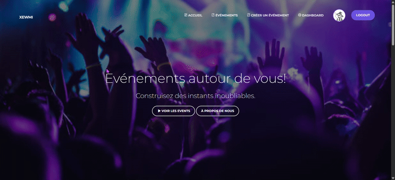
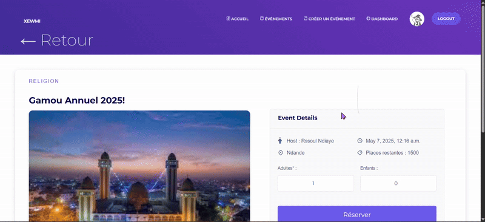
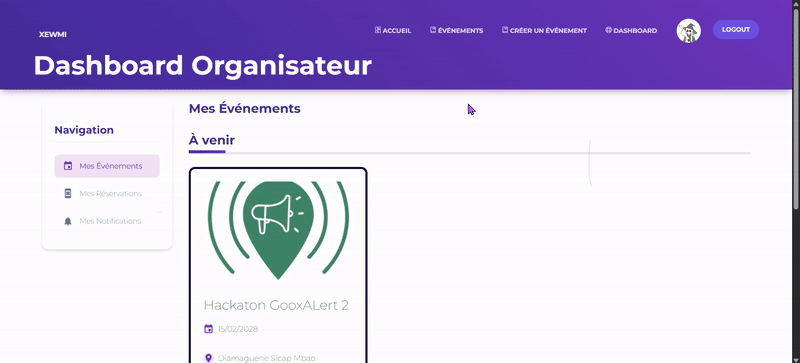
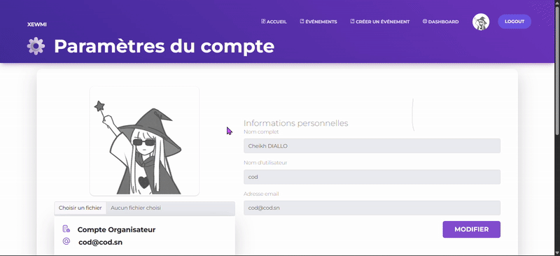

# 🎉 Réservation d'Événements — Projet NoSQL (EPT)

Mini-outil de **réservation d’événements** développé avec **Django** & **MongoDB (MongoEngine)** — réalisé dans le cadre du projet NoSQL à l’EPT.

---

## 📸 Aperçu de l’Application

Voici quelques captures d’écran de l’interface utilisateur :

### 🔐 Page de Connexion  


### 📝 Page d’Inscription  


### 🎉 Formulaire de Création d’Événement  



### 📅 Liste des Événements  


### 🛎️ Rechercher un Événement  


### 🔍 Détails d’un Événement et Réservation



### 👤 Dashboard Utilisateur  


### 🧑‍💼 Dashboard Organisateur  



### ⚙️ Paramètres Utilisateur  



## ⚙️ Prérequis

Avant tout, **assurez-vous d’avoir** :

- Python **3.11+**
- pip
- Git
- **MongoDB Compass**
- **mongosh** (Shell Mongo)
- Un compte MongoDB Atlas (création ici si besoin : <https://www.mongodb.com/cloud/atlas/register> )

---

## Connexion à la base MongoDB Atlas

Ce projet est connecté à une **base de données cloud** partagée via **MongoDB Atlas**.

> ✅ **Étapes obligatoires pour accéder à la base :**

1. **Créer un compte MongoDB Atlas** si ce n’est pas encore fait :
   <https://www.mongodb.com/cloud/atlas/register>

2. **Accepter l’invitation** de la propriétaire du projet à rejoindre le cluster partagé.  

3. Une fois accepté :
   - Se connecter au cluster sur Atlas
   - Copier le lien de la connexion
   - Ouvrir **MongoDB Compass**
   - Coller le lien de la connexion :

---

## Lancer le projet en local

### 1. Cloner le dépôt & installer l’environnement

```bash
git clone https://github.com/Thioosha/EventsNoSQL.git
cd EventsNoSQL
python -m venv venv
venv/Scripts/activate  # sous Windows
pip install -r requirements.txt
